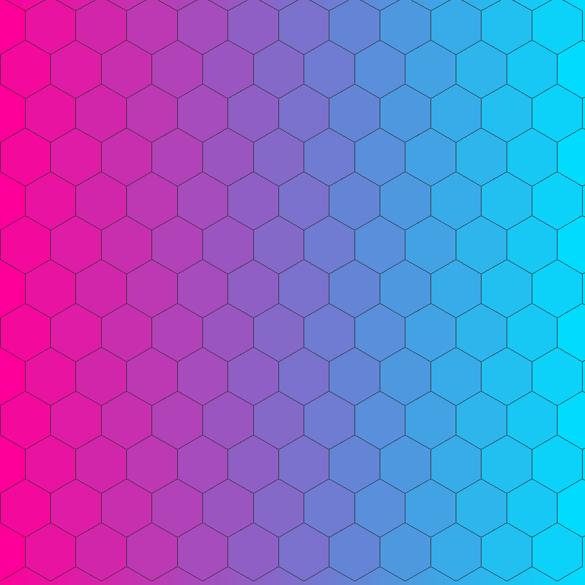
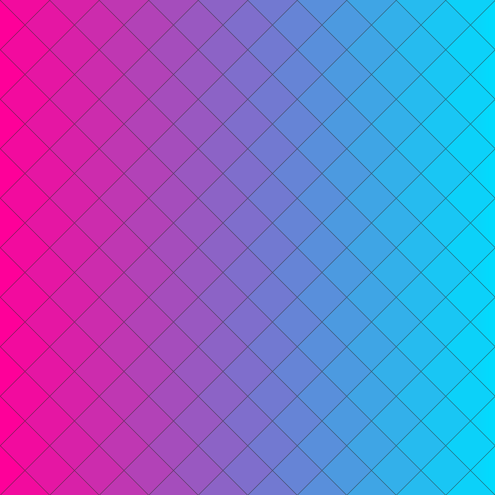
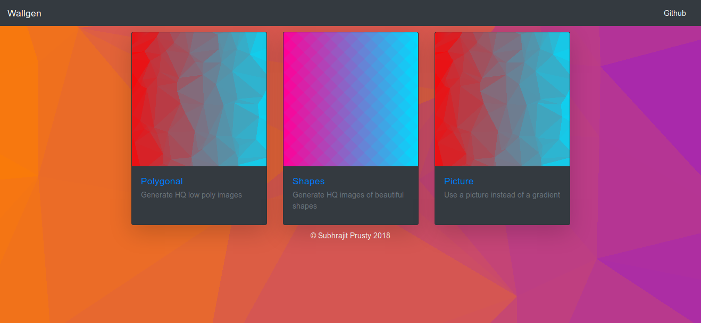
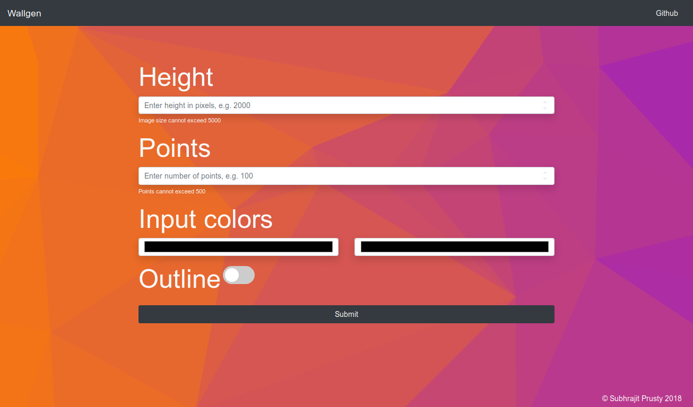
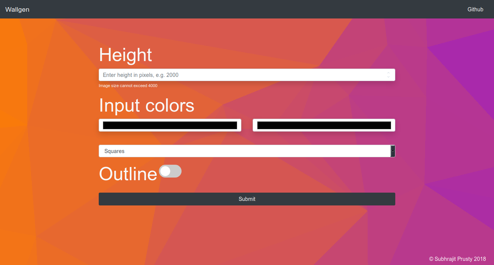

# WallGen
[](https://forthebadge.com)   [](https://forthebadge.com)  
[](http://wallgen.subhrajitpy.me/)


Generates HQ poly wallpapers

## Installation

`pip install --editable .`

## Usage Docker

Inside the folder

`docker build -t wallgen-doc:latest .`

`docker run -d -p 5000:5000 wallgen-doc`

Run `docker ps` to check if container is running.

Goto [localhost:5000](http://localhost:5000) to check out the website.


## Usage

### `wallgen`

```
Usage: wallgen [OPTIONS] COMMAND [ARGS]...

Options:
  --help  Show this message and exit.

Commands:
  poly    Generates a HQ low poly image
  shape   Generate a HQ image of a beautiful shapes
  slants  Generates slanting lines of various colors

```

### `wallgen poly --help`

```
Usage: wallgen poly [OPTIONS] SIDE

  Generates a HQ low poly image

Options:
  -c, --colors TEXT     use many colors custom gradient, e.g -c #ff0000 -c
                        #000000 -c #0000ff
  -p, --points INTEGER  number of points to use, default = 100
  -s, --show            open the image
  -o, --outline         outline the triangles
  --help                Show this message and exit.

```

### `wallgen shape --help`


```
Usage: wallgen shape [OPTIONS] SIDE

  Generate a HQ image of a beautiful shapes

Options:
  -t, --type [square|hex|diamond] choose which shape to use
                                  
  -c, --colors TEXT               use many colors custom gradient, e.g -c
                                  #ff0000 -c #000000 -c #0000ff
  -s, --show                      open the image
  -o, --outline                   outline the shapes
  --help                          Show this message and exit.

```

### `wallgen slants --help`

```
Usage: wallgen slants [OPTIONS] SIDE

  Generates slanting lines of various colors

Options:
  -s, --show  open the image
  --help      Show this message and exit.

```

## Examples


### `wallgen poly 2000`

Random Gradient


### `wallgen poly 1000 --colors "#ff0000" --colors "#00ddff"`

Fixed color/gradient


### `wallgen poly 2000 -c "#dd0000" -c "#4455ff" --points 50`

Fixed no. of points


### `wallgen poly 2000 -c "#dd0000" -c "#4455ff" -p 500`

Fixed no. of points


### `wallgen poly 2000 -c "#ff0000" -c "#000000" -c "#0000ff"`

More than 2 colours


### `wallgen poly 1000 -c "#ff0000" -c "#00ddff" -o`

With outline


### `wallgen shape -t square -c "#ff0099" -c "#00ddff"`

Square pattern


### `wallgen shape -t square -c "#ff0099" -c "#00ddff" -o`

Square pattern with Outline


### `wallgen shape -t hex -c "#ff0099" -c "#00ddff"`

Hexagon pattern


### `wallgen shape -t hexagon -c "#ff0099" -c "#00ddff" -o`

Hexagon pattern with Outline



### `wallgen shape -t diamond -c "#ff0099" -c "#00ddff"`

Diamond pattern


### `wallgen shape -t square -c "#ff0099" -c "#00ddff" -o`

Diamond pattern with Outline



### `wallgen slants 2000`

Slants pattern


## Screenshots

### Homepage



### Poly Page



### Shapes Page

