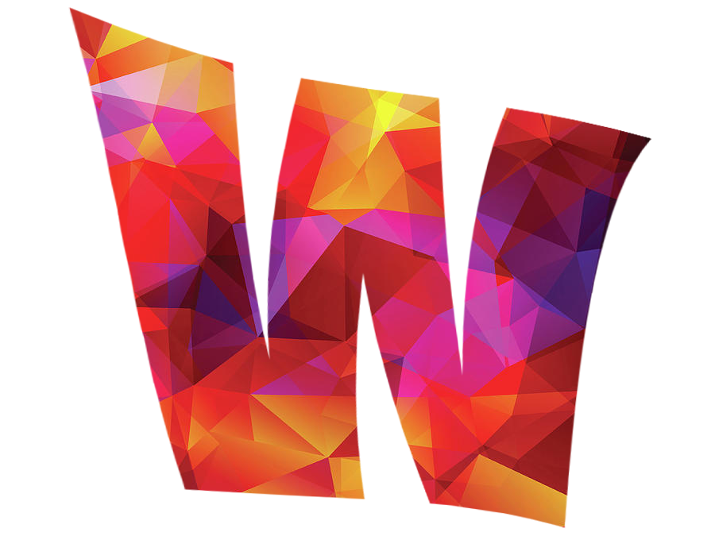

# WallGen

----
[](http://wallgen.subhrajitpy.me/)
[](https://gitter.im/wallgen/Lobby)

Generates HQ poly wallpapers

- Make poly wallpapers over a gradient with random colors, or using custom colors
- Choose different shapes like hexagons, squares, and diamonds apart from triangles
- Apply polygons over a picture
- Make a [video](https://gist.github.com/SubhrajitPrusty/5f303202c615e42e12b1a640322f9fec) with polygonized style
- Make a gradient creation [video](https://gist.github.com/SubhrajitPrusty/e994ce8f3b643382328c1c779893a721)
- Make a cool polygonal [video](https://gist.github.com/SubhrajitPrusty/37cf527ca4d92ed4a19af91099984b51)
- Dont have `Python`? Use the [website](http://wallgen.subhrajitpy.me) (Limited capabilites)

## Installation

**Requires Python 3**

Via pip

```pip
pip install -e git+https://github.com/SubhrajitPrusty/wallgen#egg=wallgen
```


Clone the repository

```
git clone https://github.com/SubhrajitPrusty/wallgen.git

cd wallgen

pip install --editable .
```

## Usage

`wallgen`

```
Usage: wallgen [OPTIONS] COMMAND [ARGS]...

Options:
  -h, --help  Show this message and exit.

Commands:
  pic     Use a picture instead of a gradient
  poly    Generates a HQ low poly image using a gradient
  shape   Generates a HQ image of a beautiful shapes
  slants  Generates slanting lines of various colors

```

----

## Usage Docker for hosting the website

Inside the folder

`docker build -t wallgen-doc:latest .`

`docker run -d -p 5000:5000 wallgen-doc`

Run `docker ps` to check if container is running.

Goto [localhost:5000](http://localhost:5000) to check out the website.

----

## Examples


`wallgen poly 2000`

Random Gradient


---

`wallgen poly 2000 --use-nn --points 5000`

NbyNGradient method

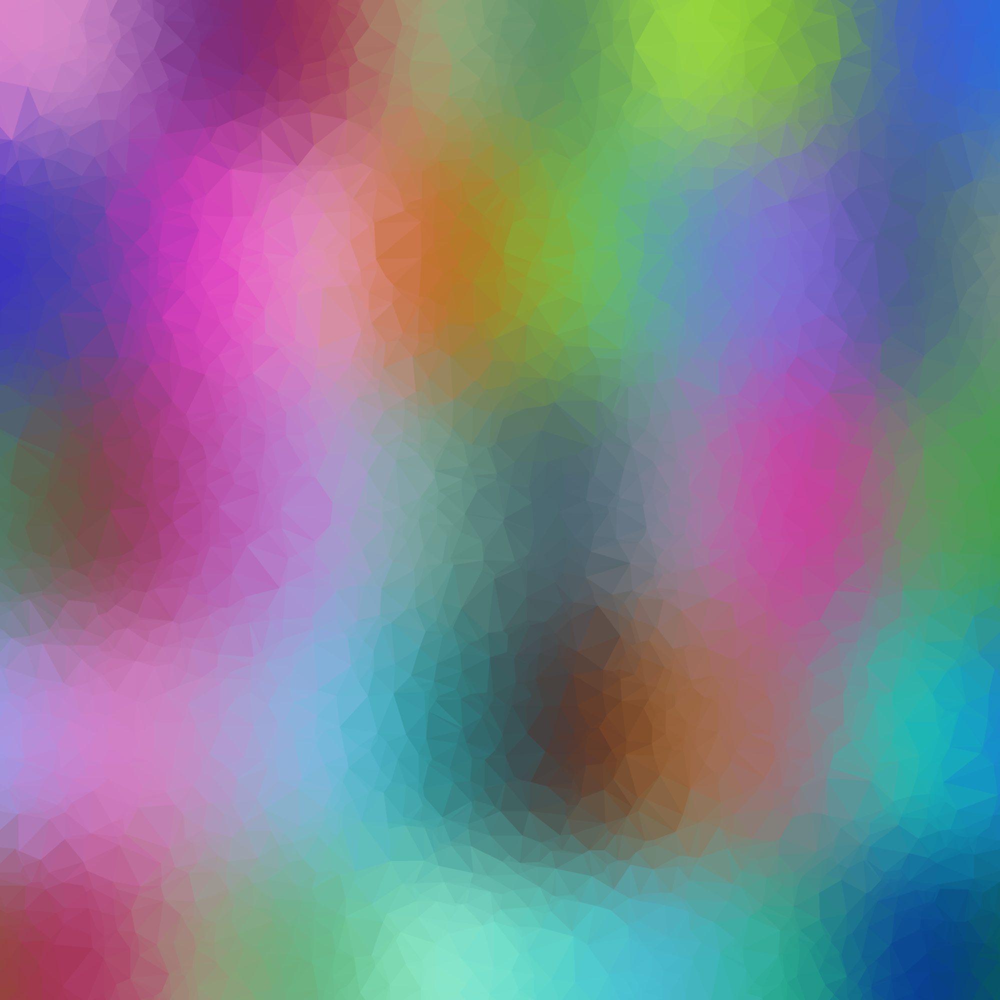

---

`wallgen poly 1000 --colors "#ff0000" --colors "#00ddff"`

Fixed color/gradient


---

`wallgen poly 2000 -c "#ff0000" -c "#00ddff" --points 2000 --swirl`

Swirl

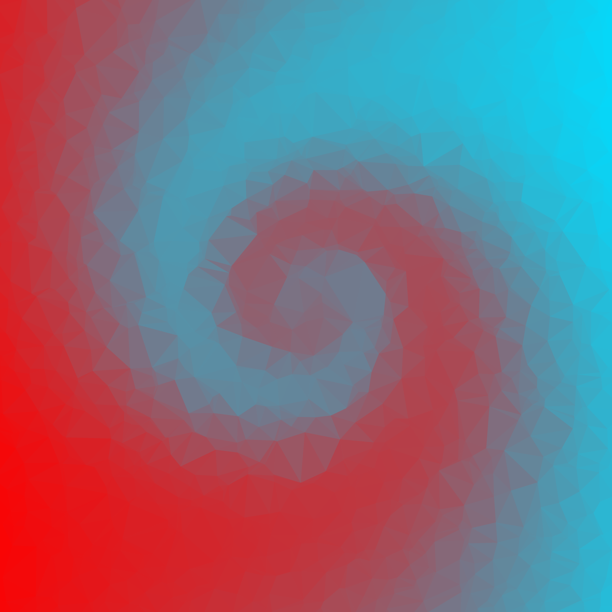

---

`wallgen poly 2000 --points 2000 -un --swirl`

NbyN and swirl

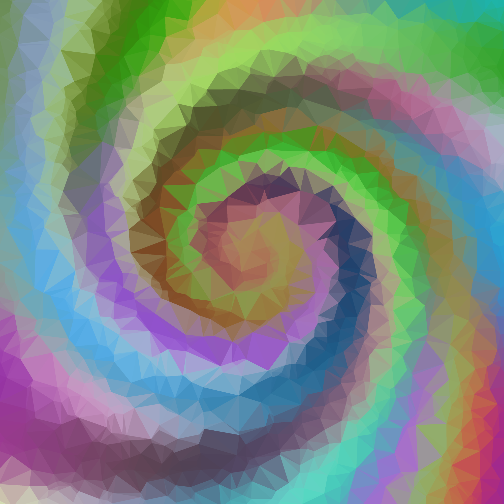

---

`wallgen poly 2000 -c "#ff0000" -c "#000000" -c "#0000ff"`

More than 2 colours

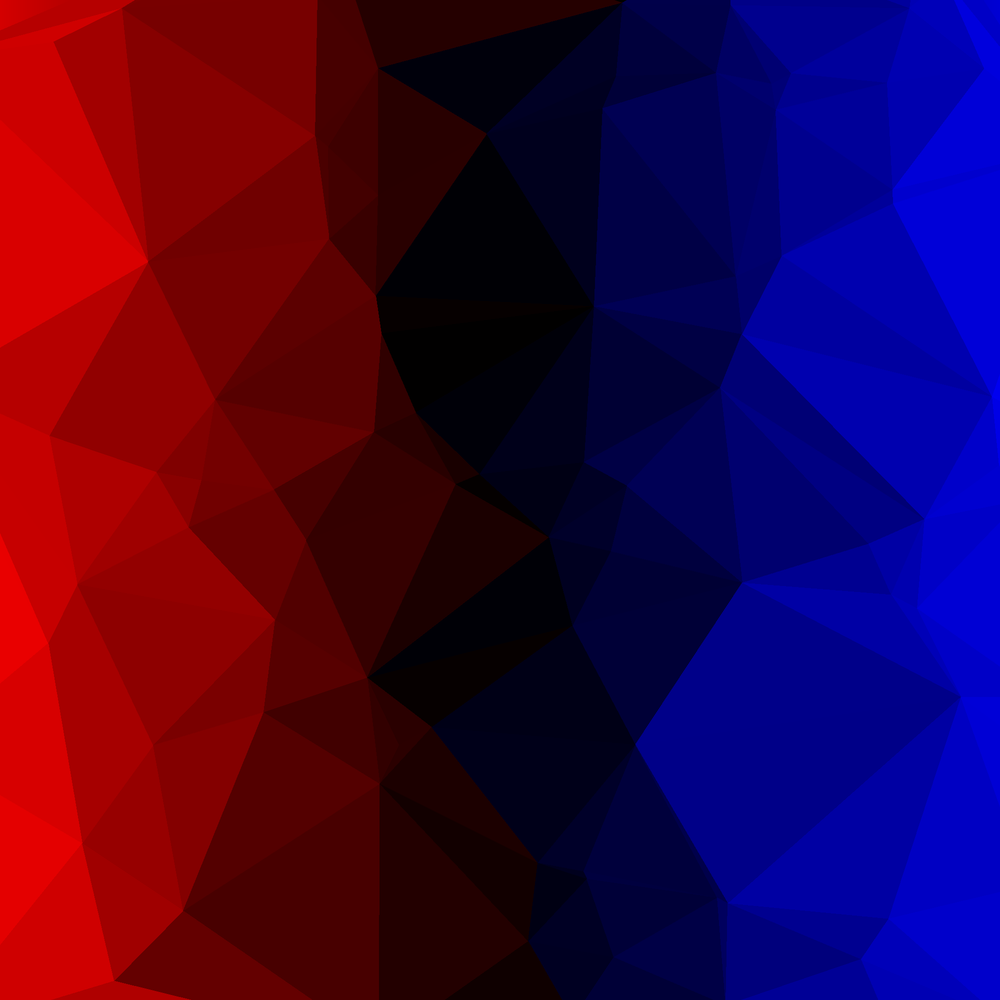

---

`wallgen poly 1000 -c "#ff0000" -c "#00ddff" -o "#2c2c2c"`

With outline

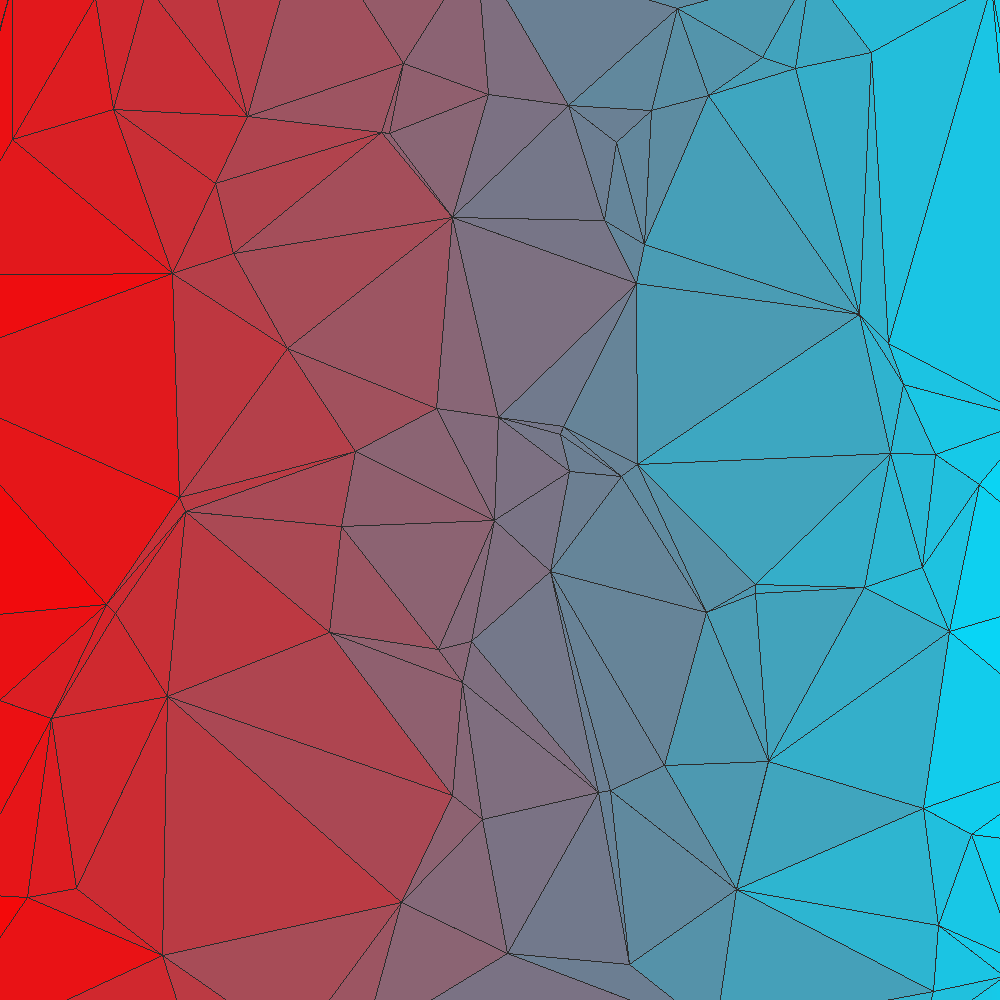

---

`wallgen shape 2000 -t square -c "#ff0099" -c "#00ddff"`

Square pattern


---

`wallgen shape 2000 -t square -c "#ff0099" -c "#00ddff" -o "#2c2c2c"`

Square pattern with Outline

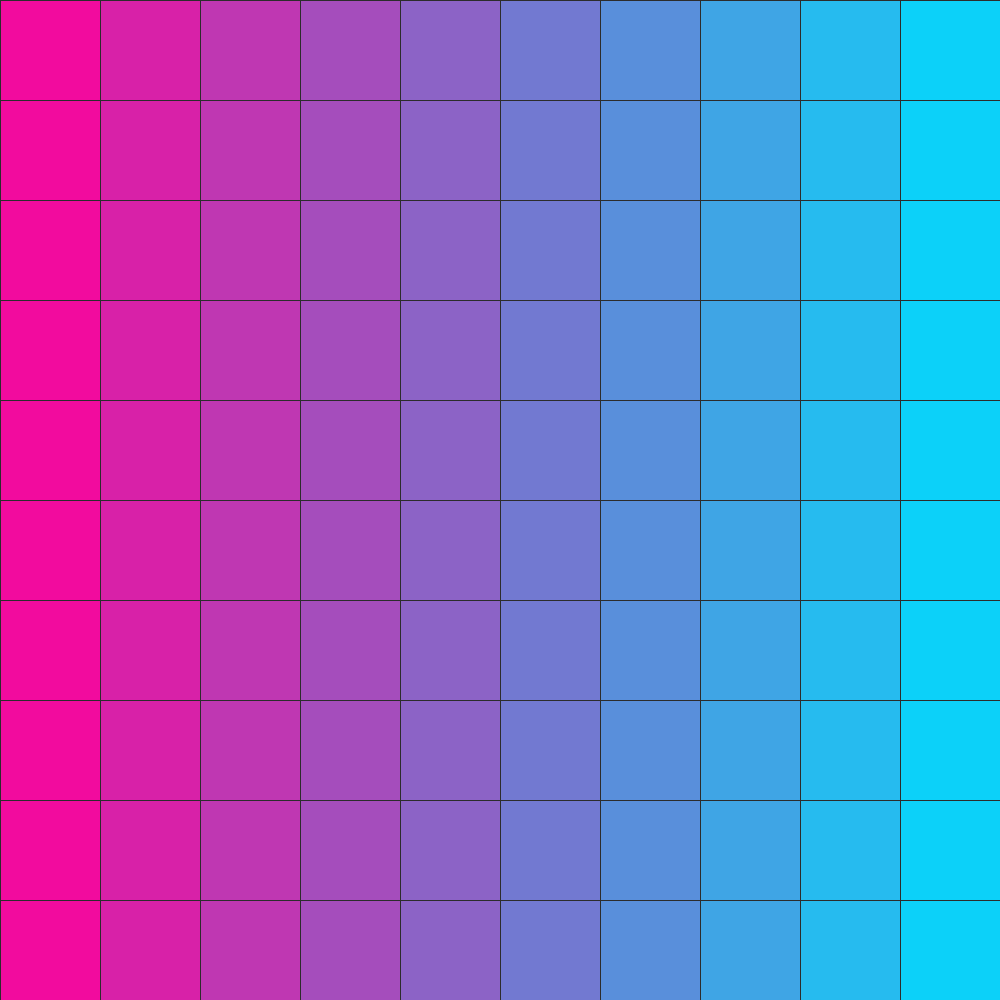

---

`wallgen shape 2000 -t square -c "#ff0099" -c "#00ddff" --swirl`

Square with swirl

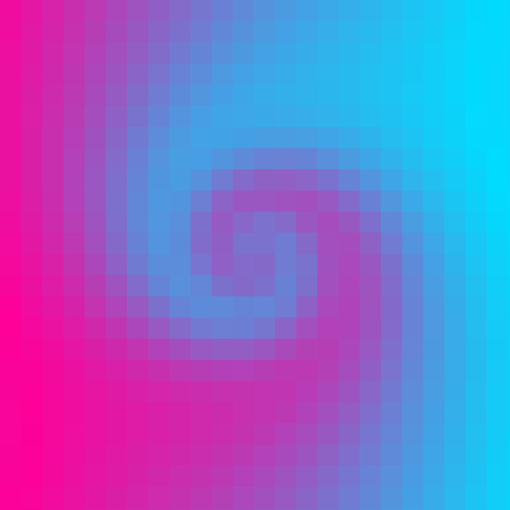

---

`wallgen shape 2000 -t hex -c "#ff0099" -c "#00ddff"`

Hexagon pattern

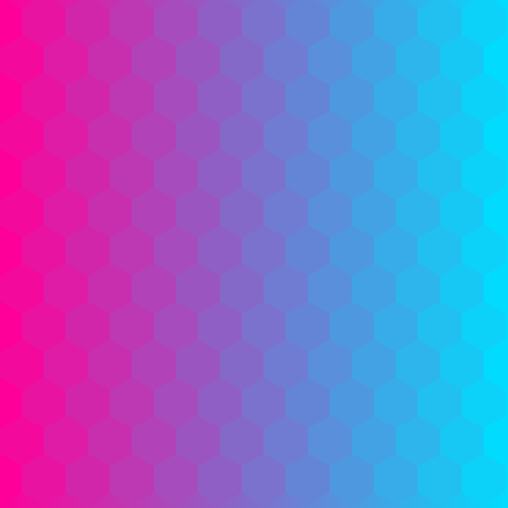

---

`wallgen shape 2000 -t diamond -c "#ff0099" -c "#00ddff"`

Diamond pattern


---

`wallgen shape 2000 -t triangle -c "#ff0099" -c "#00ddff"`

Triangle pattern


---

`wallgen slants 2000`

Slants pattern


---

`wallgen slants 2000 --swirl`

Slants with swirl


---

Polygonizing a picture

1

`wallgen pic poly bonfire.jpg -p 50000`

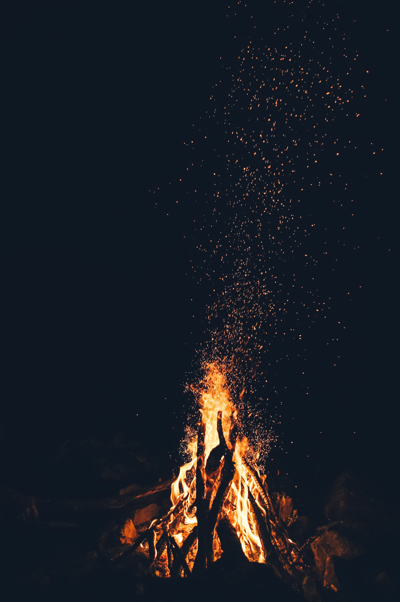


2

`wallgen pic poly anime.png -p 50000`


3

`wallgen pic poly clouds.jpg -p 50000`


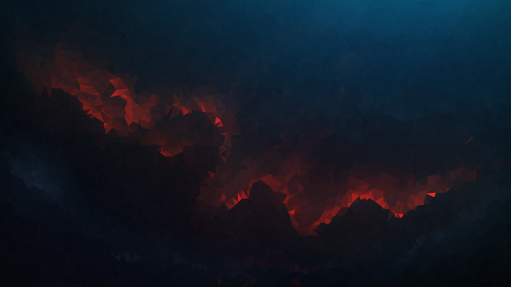

---

Using a picture with Smart edges

`wallgen pic poly art.jpg --smart`


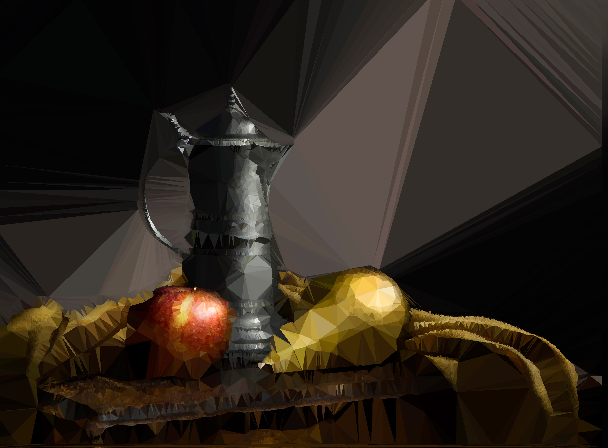

---
