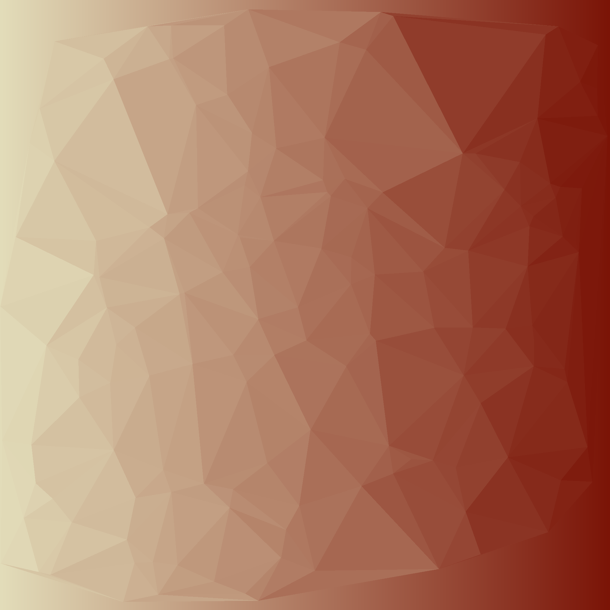
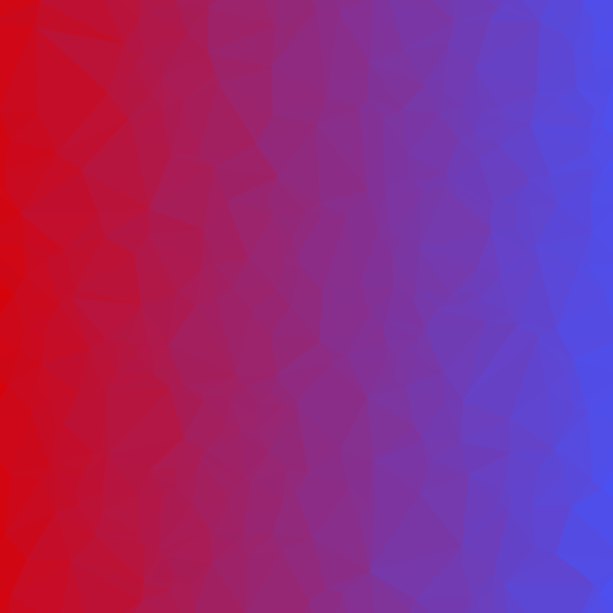
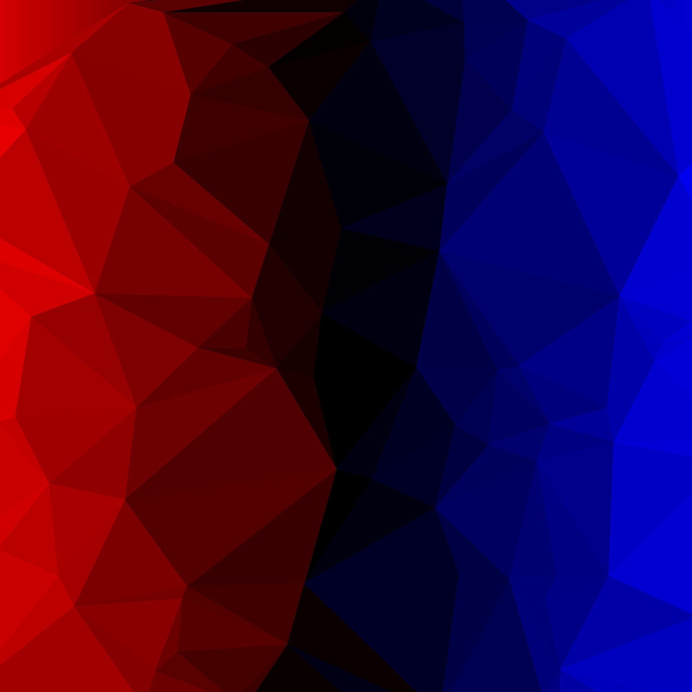
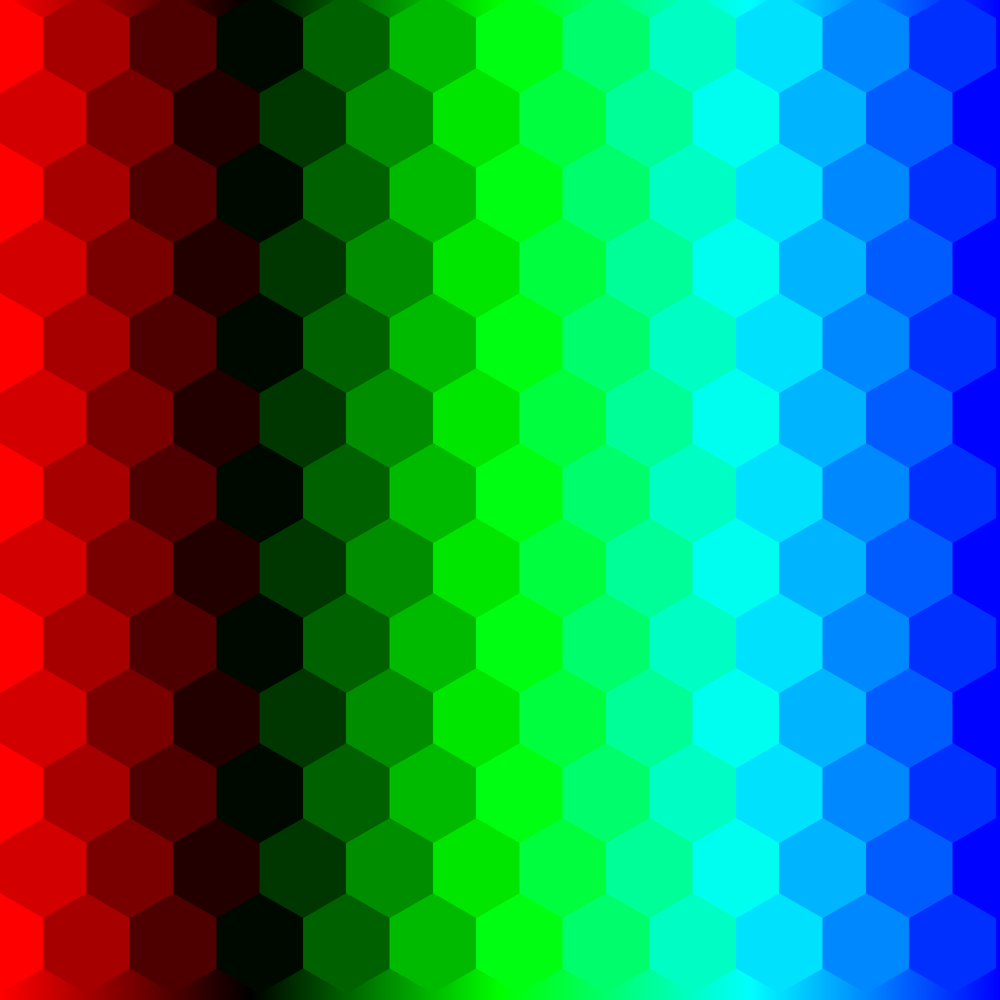
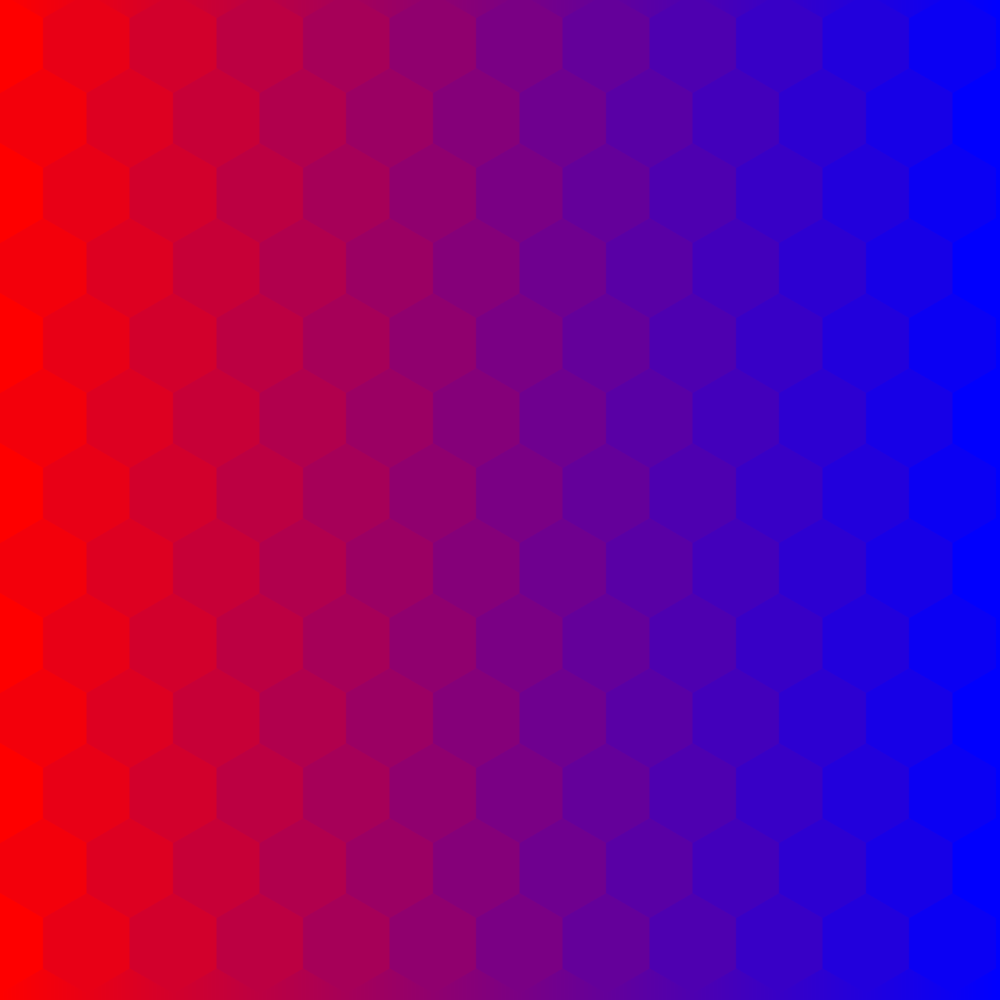
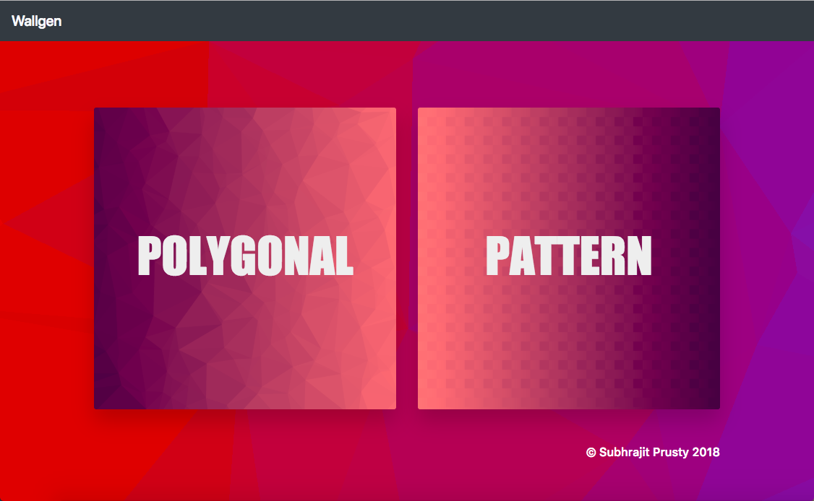

# WallGen
[](https://forthebadge.com)   [](https://forthebadge.com)  
[](http://wallgen.subhrajitpy.me/)


Generates HQ poly wallpapers

## Installation

`pip install --editable .`

## Usage Docker

Inside the folder

`docker build -t wallgen-doc:latest .`

`docker run -d -p 5000:5000 wallgen-doc`

Run `docker ps` to check if container is running.

Goto [localhost:5000](http://localhost:5000) to check out the website.


## Usage

### `wallgen`

```
Usage: wallgen [OPTIONS] COMMAND [ARGS]...

Options:
  --help  Show this message and exit.

Commands:
  pattern  Generate a HQ image of a beautiful pattern
  poly     Generates a HQ low poly image
  slants   Generates slanting lines of various colors
```

### `wallgen poly --help`

```
Usage: wallgen poly [OPTIONS] SIDE

  Generates a HQ low poly image

Options:
  -c, --colors TEXT     use many colors custom gradient, e.g -c #ff0000 -c
                        #000000 -c #0000ff
  -p, --points INTEGER  number of points to use, default = 100
  -s, --show            open the image
  --help                Show this message and exit.
```

### `wallgen pattern --help`


```
Usage: wallgen pattern [OPTIONS] SIDE

  Generate a HQ image of a beautiful pattern

Options:
  -sq, --squares     use squares instead of rhombus
  -hx, --hexagons    use Hexagons instead of rhombus (Experimental)
  -c, --colors TEXT  use many colors custom gradient, e.g -c #ff0000 -c
                     #000000 -c #0000ff
  -s, --show         open the image
  --help             Show this message and exit.
```

### `wallgen slants --help`

```
Usage: wallgen slants [OPTIONS] SIDE

  Generates slanting lines of various colors

Options:
  -s, --show  open the image
  --help      Show this message and exit.

```

## Examples


### `wallgen poly 2000`

Random Gradient


### `wallgen poly 2000 --colors "#dc2221" --colors "#35d7d6"`

Fixed color/gradient



### `wallgen poly 2000 -c "#dd0000" -c "#4455ff" --points 50`

Fixed no. of points


### `wallgen poly 2000 -c "#dd0000" -c "#4455ff" -p 500`

Fixed no. of points



### `wallgen poly 2000 -c "#ff0000" -c "#000000" -c "#0000ff"`

More than 2 colours


### `wallgen pattern 2000 --squares -c "#dd0000" -c "#4455ff"`

Square pattern


### `wallgen pattern 2000 --hexagons -c "#ff0000" -c "#0000ff"`

Hexagon pattern



### `wallgen pattern 2000 -hx -c "#ff0000" -c "#000000" -c "#00ff00" -c "#00ffff" -c "#0000ff"`

Multicoloured gradient, hexagon pattern



### `wallgen slants 2000`

Slants pattern




## Screenshots

### `Homepage`



### `Poly_Demo`


### `Wallgen1`


### `Square_Demo`


### `Wallgen2`


