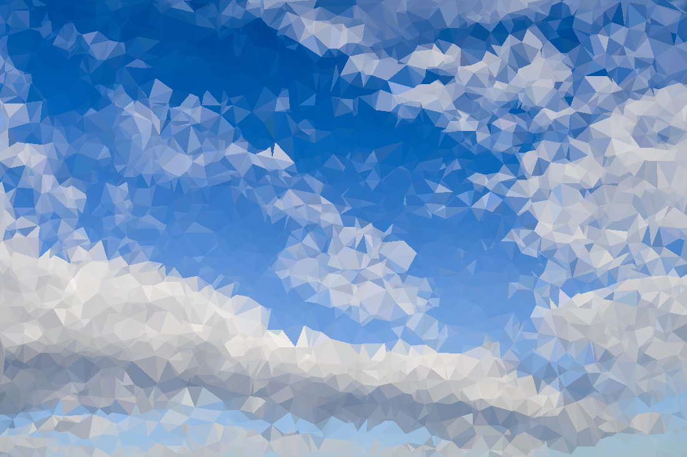

# WallGen

---
[](http://wallgen.subhrajitpy.me/) [](https://gitter.im/wallgen/Lobby?utm_source=badge&utm_medium=badge&utm_campaign=pr-badge&utm_content=badge)


Generates HQ poly wallpapers

- Make poly wallpapers over a gradient with random colors, or using custom colors
- Choose different shapes like hexagons, squares, and diamonds apart from triangles
- Apply polygons over a picture
- Make a [video](https://gist.github.com/SubhrajitPrusty/5f303202c615e42e12b1a640322f9fec) with polygonized style
- Make a gradient creation [video](https://gist.github.com/SubhrajitPrusty/e994ce8f3b643382328c1c779893a721)
- Make a cool polygonal [video](https://gist.github.com/SubhrajitPrusty/37cf527ca4d92ed4a19af91099984b51)
- Dont have `Python`? Use the [website](http://wallgen.subhrajitpy.me) (Limited capabilites)


## Installation

Clone repository

```
git clone https://github.com/SubhrajitPrusty/wallgen.git

cd wallgen

pip install --editable .
```

## Usage

### `wallgen`

```
Usage: wallgen [OPTIONS] COMMAND [ARGS]...

Options:
  --help  Show this message and exit.

Commands:
  pic     Use a picture instead of a gradient
  poly    Generates a HQ low poly image
  shape   Generates a HQ image of a beautiful shapes
  slants  Generates slanting lines of various colors

```

### `wallgen poly --help`

```
Usage: wallgen poly [OPTIONS] SIDE

  Generates a HQ low poly image

Options:
  -c, --colors TEXT     use many colors custom gradient, e.g -c #ff0000 -c
						#000000 -c #0000ff
  -p, --points INTEGER  number of points to use, default = 100
  -s, --show            open the image
  -o, --outline         outline the triangles
  -n, --name TEXT       rename the output
  --help                Show this message and exit.

```

### `wallgen shape --help`


```
Usage: wallgen shape [OPTIONS] SIDE

  Generates a HQ image of a beautiful shapes

Options:
  -t, --type [square|hex|diamond|triangle]
								  choose which shape to use
  -c, --colors TEXT               use many colors custom gradient, e.g -c
								  #ff0000 -c #000000 -c #0000ff
  -p, --percent INTEGER           Use this percentage to determine number of
								  polygons. [1-10]
  -s, --show                      open the image
  -o, --outline TEXT              outline the shapes
  -n, --name TEXT                 rename the output
  --help                          Show this message and exit.

```

### `wallgen slants --help`

```
Usage: wallgen slants [OPTIONS] SIDE

  Generates slanting lines of various colors

Options:
  -s, --show       open the image
  -n, --name TEXT  rename the output
  --help           Show this message and exit.

```

### `wallgen pic --help`

```
Usage: wallgen pic [OPTIONS] COMMAND [ARGS]...

  Use a picture instead of a gradient

Options:
  --help  Show this message and exit.

Commands:
  poly   Generates a HQ low poly image
  shape  Generate a HQ image of a beautiful shapes

```

### `wallgen pic poly --help`

```
Usage: wallgen pic poly [OPTIONS] IMAGE

  Generates a HQ low poly image

Options:
  -p, --points INTEGER  number of points to use, default = 1000
  -s, --show            open the image
  -o, --outline         outline the triangles
  -n, --name TEXT       rename the output
  --help                Show this message and exit.
  
```

### `wallgen pic shape --help`

```
Usage: wallgen pic shape [OPTIONS] IMAGE

  Generate a HQ image of a beautiful shapes

Options:
  -t, --type [square|hex|diamond|triangle]
								  choose which shape to use
  -p, --percent INTEGER           Use this percentage to determine number of
								  polygons. [1-10]
  -s, --show                      open the image
  -o, --outline TEXT              outline the shapes
  -n, --name TEXT                 rename the output
  --help                          Show this message and exit.

```
---

## Usage Docker for website

Inside the folder

`docker build -t wallgen-doc:latest .`

`docker run -d -p 5000:5000 wallgen-doc`

Run `docker ps` to check if container is running.

Goto [localhost:5000](http://localhost:5000) to check out the website.

---

## Examples


### `wallgen poly 2000`

Random Gradient


### `wallgen poly 1000 --colors "#ff0000" --colors "#00ddff"`

Fixed color/gradient


### `wallgen poly 2000 -c "#dd0000" -c "#4455ff" --points 50`

Fixed no. of points


### `wallgen poly 2000 -c "#dd0000" -c "#4455ff" -p 500`

Fixed no. of points


### `wallgen poly 2000 -c "#ff0000" -c "#000000" -c "#0000ff"`

More than 2 colours


### `wallgen poly 1000 -c "#ff0000" -c "#00ddff" -o "#2c2c2c"`

With outline


### `wallgen shape 2000 -t square -c "#ff0099" -c "#00ddff"`

Square pattern


### `wallgen shape 2000 -t square -c "#ff0099" -c "#00ddff" -o "#2c2c2c"`

Square pattern with Outline


### `wallgen shape 2000 -t hex -c "#ff0099" -c "#00ddff"`

Hexagon pattern


### `wallgen shape 2000 -t hex -c "#ff0099" -c "#00ddff" -o "#2c2c2c"`

Hexagon pattern with Outline


### `wallgen shape 2000 -t diamond -c "#ff0099" -c "#00ddff"`

Diamond pattern


### `wallgen shape 2000 -t diamond -c "#ff0099" -c "#00ddff" -o "#2c2c2c"`

Diamond pattern with Outline


### `wallgen shape 2000 -t triangle -c "#ff0099" -c "#00ddff"`

Triangle pattern


### `wallgen shape 2000 -t triangle -c "#ff0099" -c "#00ddff" -o "#2c2c2c"`

Triangle pattern with Outline


### `wallgen slants 2000`

Slants pattern


### `wallgen pic poly lion.jpg -p 50000`

Using a picture with 50000 points

1


2


3





## Screenshots

### Homepage


### Poly Page


### Shapes Page


### Pic Page


