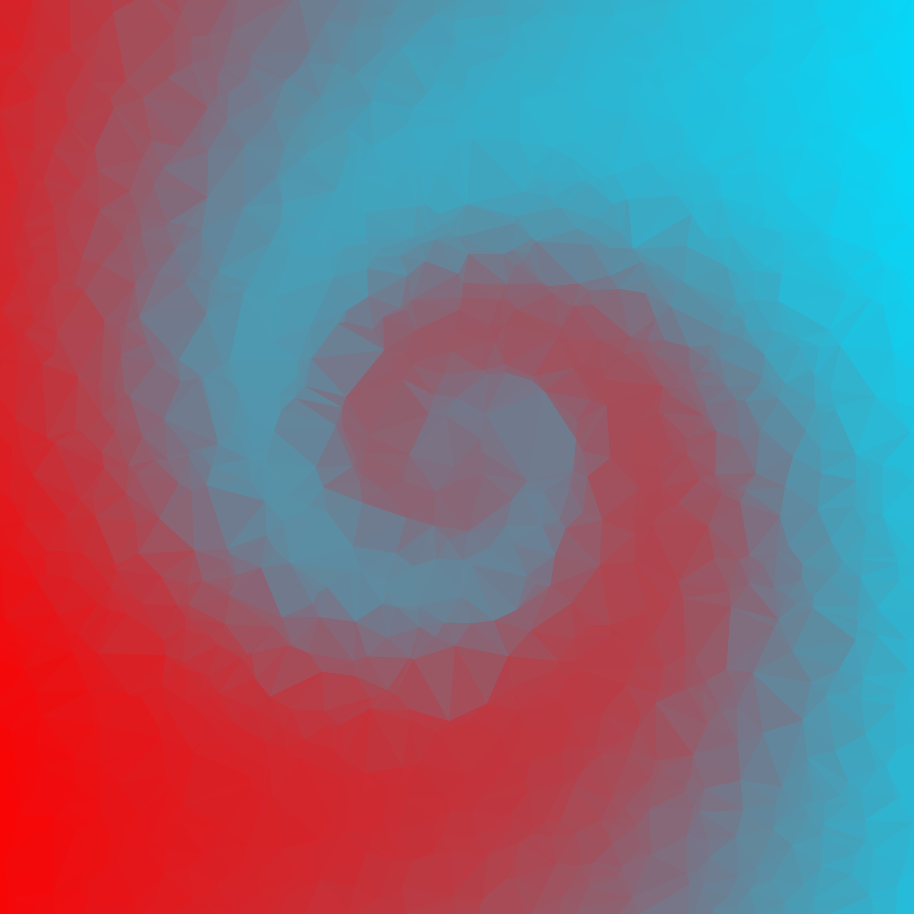
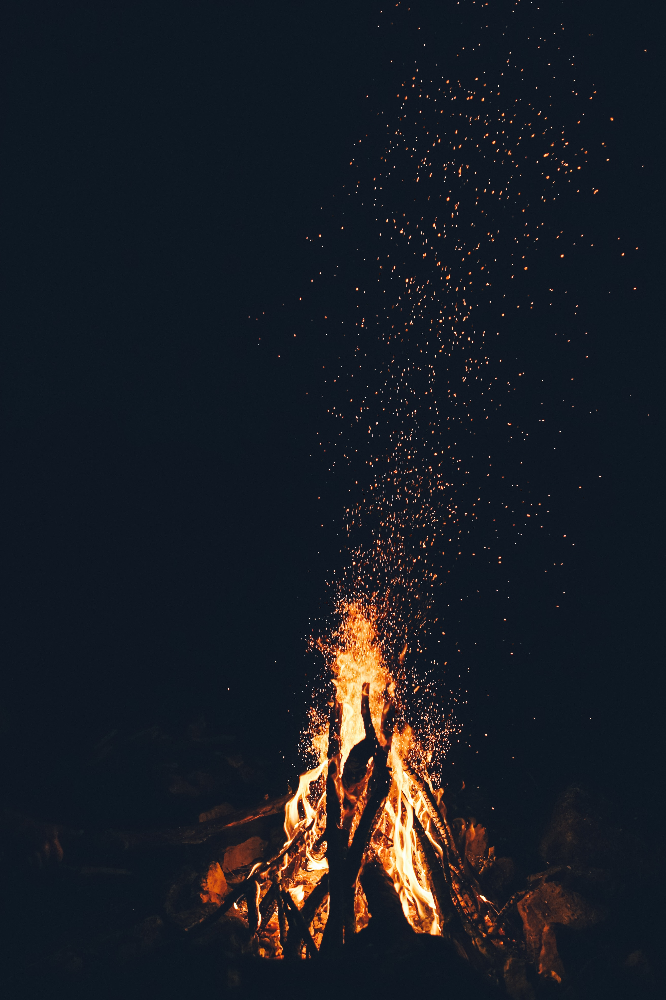
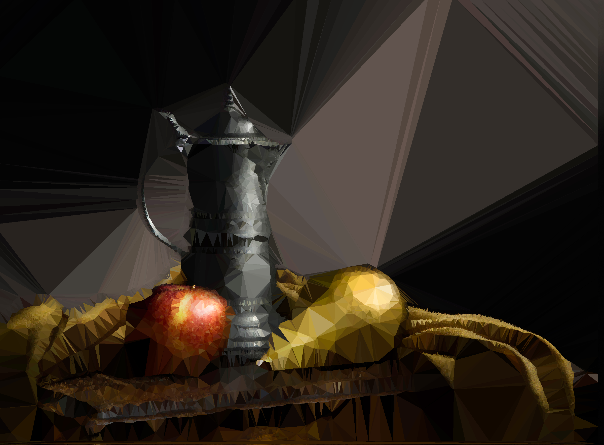

# Examples

`wallgen poly 2000`

Random Gradient

---

`wallgen poly 2000 --use-nn --points 5000`

NbyNGradient method

---

`wallgen poly 1000 --colors "#ff0000" --colors "#00ddff"`

Fixed color/gradient

---

`wallgen poly 2000 -c "#ff0000" -c "#00ddff" --points 2000 --swirl`

Swirl

---

`wallgen poly 2000 --points 2000 -un --swirl`

NbyN and swirl

---

`wallgen poly 2000 -c "#ff0000" -c "#000000" -c "#0000ff"`

More than 2 colours

---

`wallgen poly 1000 -c "#ff0000" -c "#00ddff" -o "#2c2c2c"`

With outline

---

`wallgen shape 2000 -t square -c "#ff0099" -c "#00ddff"`

Square pattern

---

`wallgen shape 2000 -t square -c "#ff0099" -c "#00ddff" -o "#2c2c2c"`

Square pattern with Outline

---

`wallgen shape 2000 -t square -c "#ff0099" -c "#00ddff" --swirl`

Square with swirl

---

`wallgen shape 2000 -t hex -c "#ff0099" -c "#00ddff"`

Hexagon pattern

---

`wallgen shape 2000 -t diamond -c "#ff0099" -c "#00ddff"`

Diamond pattern

---

`wallgen shape 2000 -t triangle -c "#ff0099" -c "#00ddff"`

Triangle pattern

---

`wallgen slants 2000`

Slants pattern

---

`wallgen slants 2000 --swirl`

Slants with swirl

---

Polygonizing a picture

1

`wallgen pic poly bonfire.jpg -p 50000`

2

`wallgen pic poly anime.png -p 50000`

3

`wallgen pic poly clouds.jpg -p 50000`

---

Using a picture with Smart edges

`wallgen pic poly art.jpg --smart`

---
